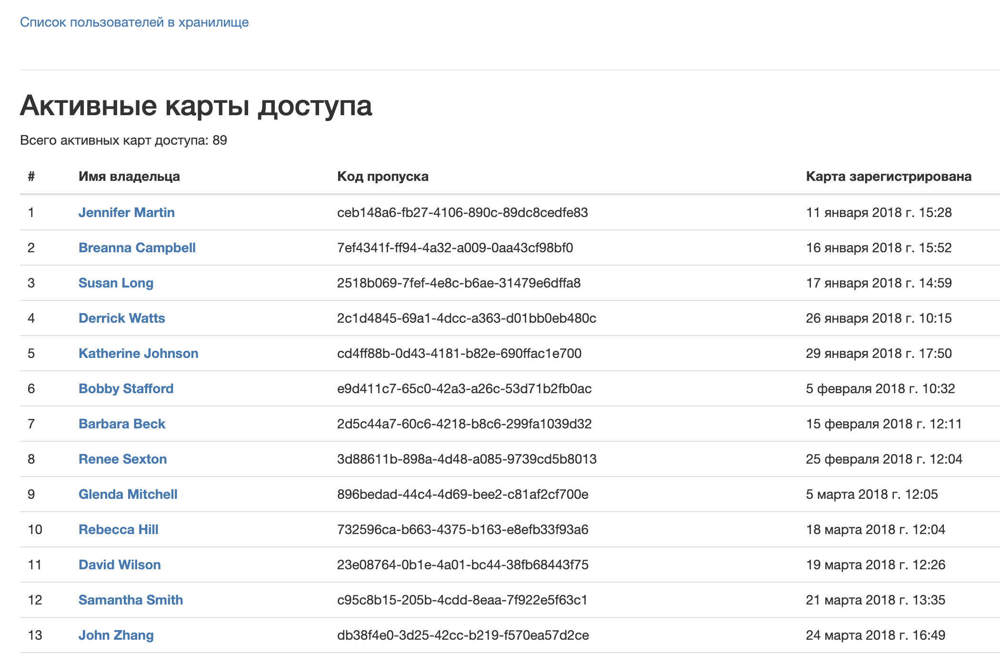

# Bank vault security system

This project is a site for a bank vault security system.



## Installation notes
1. Clone project
```bash
git clone https://github.com/gennadis/bank-vault-security.git
cd bank-vault-security
```

2. Create virtual environment
```bash
python3 -m venv env
source env/bin/activate
```

3. Install requirements
```bash
pip install -r requirements.txt
```
4. Enter Database credentials in `project/settings.py`

5. Run
```bash
python main.py
```

6. Open
Open site in browser [http://0.0.0.0:8000/](http://0.0.0.0:8000/)
